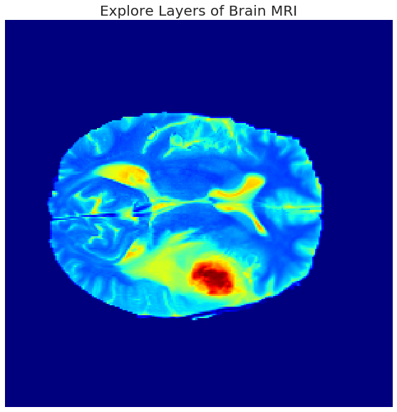
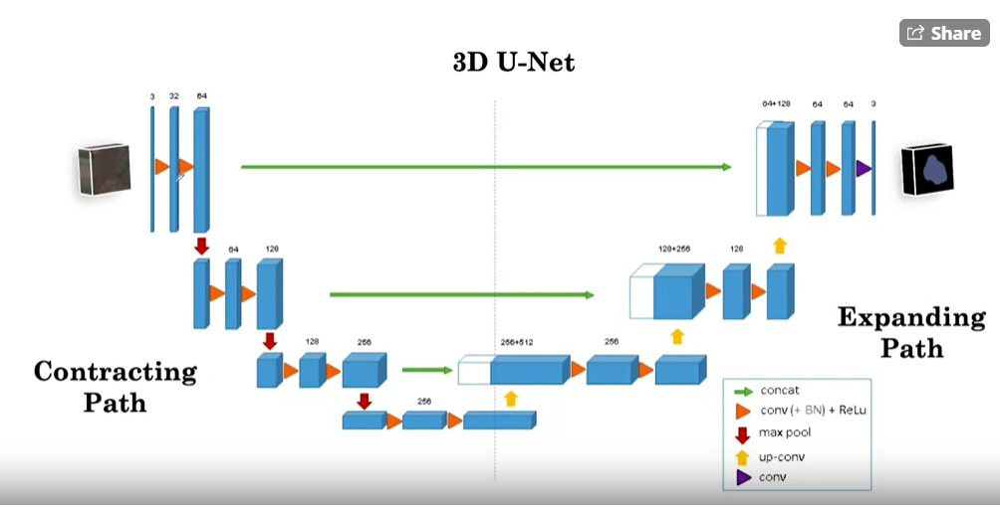
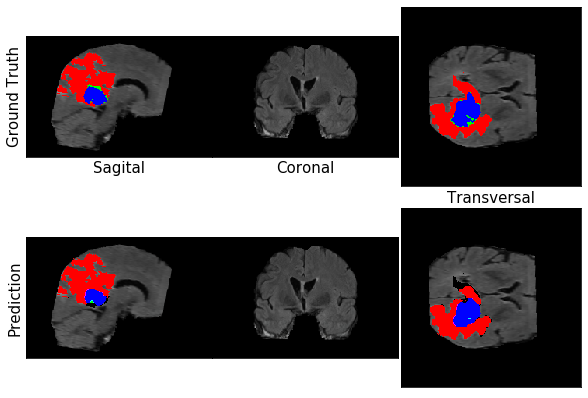
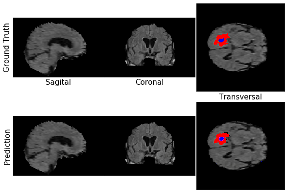

# 3D-MRI Brain-tumor segmentation with UNET-3D  Medical Diagnosis with Deep Learning

- Pre-process and prepare a real-world 3D MRI dataset
- Use transfer learning to retrain a  UNET3D model for segmentation
- Measure diagnostic performance by computing the softdice loss, and dice-coefficeint, sensitivity and specitivity.

## 1.Pre-Processing : 

- 3D MRI brain scans from the public Medical Segmentation Decathlon challenge project. This is an incredibly rich dataset that provides you with labels associated with each point (voxel) inside a 3D representation of a patient's brain. Ultimately, in this week's assignment, you will train a neural network to make three-dimensional spatial segmentation predictions for common brain disorders.

dimensions: height: 240, width:240, depth:155, channels:4

###### Visualize the data

The "depth" listed above indicates that there are 155 layers (slices through the brain) in every image object.below is a random slice within 1 to 155.
 

1. create sub-volums of the 3d mri volume
2. makes it computationally effficient.
3. disadv is losses the contextual knowledge.

## 2.Model training :

- Total params: 833,507
- Trainable params: 833,507
- Non-trainable params: 0

For a brief video introduction to U-Net by the original creators, Olaf Ronneberger, Philipp Fischer, Thomas Brox, please visit their site U-Net: Convolutional Networks for Biomedical Image Segmentation.  

If you would like more detail, start with this blog post by Heet Sankesara “UNet”.  

To go deeper, you can read the original research paper U-Net: Convolutional Networks for Biomedical Image Segmentation by Olaf Ronneberger, Philipp Fischer, Thomas Brox

As a reminder, you will be using a pre-trained U-Net model, and so you can still complete this course without knowing the specific details of implementing the U-Net from scratch.

#### Loss function

- Soft Dice Loss

#### Training loss :

## 3.Evaluation tools :

#### Dice co-efficeint: 
- lies between 0 to 1
- 1 is better ,means all the predicted area and ground truth area overlap perfectly .
- 0 is worst.

#### Sensitivity:
- P(predicted_positive | actual_positive)
- TP/(TP + FN)
- Sensitivity only considers output on people in the positive class

#### Specificity (recall):

- P(predicted_negative | actual_negative)
- TN/(TN + FP)
-  specificity only considers output on people in the negative class.

Predictions :
1.

2. 

